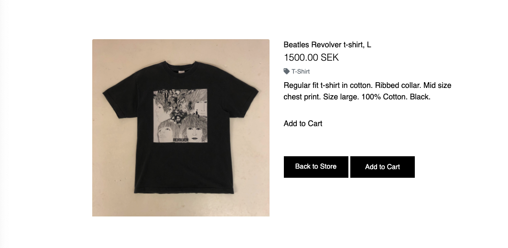
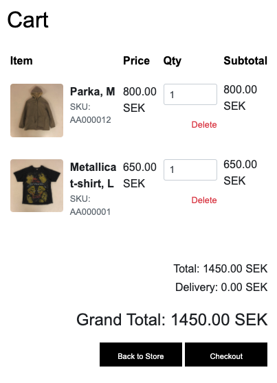
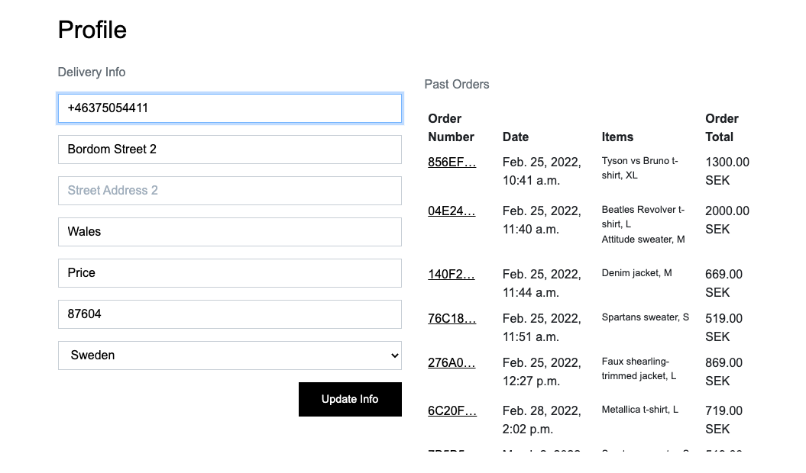
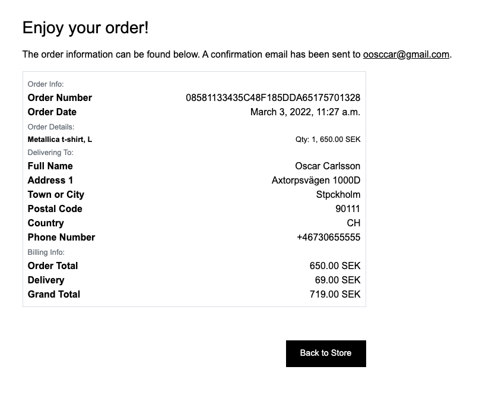
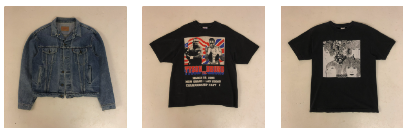

# Introduction

This project was treated as an order from a client, the customer is a company which sells vintage clothing in Sweden and is named Úma. The goal was to create a website with a scandinavian minimalist design with focus on the content, which in their case are the pieces of clothing that they sell. Of course the site also needed to provide all the functionalites that would be necessary to launch the site and enalbe the customer to use the project as a real webstore.


 
 ## Index – Table of Contents    

* [UX](##UX)

* [User Stories](##User)

* [Wireframe](##Wireframe)

* [Features](##Features)  

* [Future Features](##Future)

* [Facebook Page](##Facebook)

* [Testing](##Testing)

* [Models](##Models)

* [Deployment](##Deployment)

* [Credits](##Credits)

* [Acknowledgements](##Acknowledgements)  

## UX 

The design of the website has been a collaboration with the author and the storeowners ideas for how the store should look. The minimalist design has it's limitations in terms of UX since it can come of as unclear. I'm aware that the lack of langueage could be a cause for concern since how to use the site can vauge to some people. But since it was pretty much a requirement from the client to keep language to a minimum I've tried to use as familiar symbols a possible to minimize confusion.

On the first page on is greeted with a rotating company logo. The company logo is based on a LP shape, the choice to rotate it for this reason probably is obvious. The first idea was to spin the LP in the same pace as it normally would, which is 33 roations a minute. Unfortunatly this made it possible to read what is written on the logo so a slower rotation speed was settled on.

The goal with the different parts of the site has been to keep them as similar as possible. 
The sites main color is white with black text, symbols and buttons. The choice to use white and black is a decision made with the intention to keep the content in focus, it was also based on the whishes of the client.

The footer is despite it's languge very similar to the header in terms on design, the letters are bold and the Facebook and Instagram logos is a familiar symbols to most people.

## Wireframe


## User stories


## Features

### Header

Except for showing the name of the company which takes one to the front-page the header of the page has svereal functionalites. The drop down menu on the left is a filter, a user can filter through the products by price, category, clothing and go back to show all.
On the right there are three symbols the first symbolises a profile, it gives one the ability to sign in or up. What is possible while logged in as a user or superuser will be covered later on. The second symbol is a cart it takes one to the customers cart. If a product has been added a circle is shown under the cart with a number which shows how many products are in the cart. The color of the circle is based on onw of the colors in the logo. The third displays a searchbar while clicked it displays a input field.


### Footer

The footers content consist of a copyright symbol, about page and contact page links that are intended to be created in future and a facebook link that would guide one to a facebook page if there was one. Instead screenshots of the facebook page are shown later in the README.


### Products page

After one has entered the site via the index page one is greeted with all products available on the site. When having scrolled to the bottom of the page there is a arrow symbol which when clicked sends the user back to the top of the page.


### Product details pages

When clicking on a product the user is shown info about the product and is given the option to add the product to the cart or go back to the store.



### Cart page

The cart displays the products that are in the cart, some general info about the products and the total, delivery cost and grand total.



### Profile

Users of the site can create their own profile, the main features availbable to a user is being able to save their delivery info and keep track of previous orders.



### Superuser

On top of the features availabel to a regular profile a supersusers profile has the abillity to add, edit and delete products from the site without having to use the admin page. 


### SKU

Since each product on the site is unique a product can not be added more than once and the maximum quantity is one. After the checkout the product is deleted.


### Messages

Depending on what a user or superuser does on the site their are associated toast messages to clarify if an action went according to plan, if there are any issues with the site or the way an action was performed.


### Checkout page

The checkout page displays a form with details that fully or partially needs to be filled in depending on if the user has a profile or not and if the user has saved its delivery information previously. The form also includes an input field for payment information. The page also includes an order summary and finally two button which let one go back to the cart or go through with the order.


### Stripe 

Users can checkout using [Stripe](https://stripe.com/docs/security/stripe), which is a well establised and safe payment provider.


### Checkout success page

If the form was filled in correctly and the payment goes through one is sent to the checkout success page. It confirms to the customer that the order went through and shows the order info as well as a button that takes one back to the store.



### Order confirmation email


## Future features

* Create a about page with the story about the company and pictures of the store.
* Create a contact page.
* Launch 

## Facebook page


## Testing

The testing can be found [here](TEST.md).

## Models 

* Checkout models

The model generates an order, a unique order number and updates the grand total of the order based on if the total is under or above the delivery threshold and creates a unique order number.

```python
class Order(models.Model):
    order_number = models.CharField(max_length=32, null=False, editable=False)
    user_profile = models.ForeignKey(Profiles, on_delete=models.SET_NULL,
                                     null=True, blank=True,
                                     related_name='orders')
    full_name = models.CharField(max_length=50, null=False, blank=False)
    email = models.EmailField(max_length=254, null=False, blank=False)
    phone_number = models.CharField(max_length=20, null=False, blank=False)
    country = CountryField(blank_label='Country *', null=False, blank=False)
    postcode = models.CharField(max_length=20, null=True, blank=True)
    town_or_city = models.CharField(max_length=40, null=False, blank=False)
    street_address1 = models.CharField(max_length=80, null=False, blank=False)
    street_address2 = models.CharField(max_length=80, null=True, blank=True)
    county = models.CharField(max_length=80, null=True, blank=True)
    date = models.DateTimeField(auto_now_add=True)
    delivery_cost = models.DecimalField(max_digits=6, decimal_places=2,
                                        null=False, default=0)
    order_total = models.DecimalField(max_digits=10, decimal_places=2,
                                      null=False, default=0)
    grand_total = models.DecimalField(max_digits=10, decimal_places=2,
                                      null=False, default=0)
    original_cart = models.TextField(null=False, blank=False, default='')
    stripe_pid = models.CharField(max_length=254, null=False, blank=False,
                                  default='')

    def _generate_order_number(self):
        """
        uuid generates a random number, which will be used for the order
        """
        return uuid.uuid4().hex.upper()

    def update_order(self):
        """
        Update grand total each time a line item is added,
        accounting for delivery costs.
        """
        self.order_total = self.lineitems.aggregate(Sum('lineitem_total'))['lineitem_total__sum'] or 0
        if self.order_total < settings.FREE_DELIVERY_THRESHOLD:
            self.delivery_cost = 69
        else:
            self.delivery_cost = 0
        self.grand_total = self.order_total + self.delivery_cost
        self.save()

    def save(self, *args, **kwargs):
        """ If no previous order number has been set, the function overrides the
            initial save method to set one
        """
        if not self.order_number:
            self.order_number = self._generate_order_number()
        super().save(*args, **kwargs)

    def __str__(self):
        return self.order_number
```

The model works in conjunction with the order model and ensures that the products are part of the checkout. If there is more than one of a product (rare but happens within vintage), it updates the order total based on quantity.

```python
class OrderLineItem(models.Model):
    order = models.ForeignKey(Order, null=False, blank=False,
                              on_delete=models.CASCADE,
                              related_name='lineitems')
    product = models.ForeignKey(Product, null=False, blank=False,
                                on_delete=models.CASCADE)
    quantity = models.IntegerField(null=False, blank=False, default=0)
    lineitem_total = models.DecimalField(max_digits=6, decimal_places=2,
                                         null=False, blank=False,
                                         editable=False)

    def save(self, *args, **kwargs):
        """
        Override the original save method to set the lineitem total
        and update the order total.
        """
        self.lineitem_total = self.product.price * self.quantity
        super().save(*args, **kwargs)

    def __str__(self):
        return f'SKU {self.product.sku} on order {self.order.order_number}'
```

* Products models

The model works in conjunction with the categories.js fixture to enable categorization of products.

```python
class Category(models.Model):

    class Meta:
        verbose_name_plural = 'Categories'

    name = models.CharField(max_length=254)
    friendly_name = models.CharField(max_length=254, null=True, blank=True)

    def __str__(self):
        return self.name

    def get_friendly_name(self):
        return self.friendly_name
```

The model works in conjunction with the Category model to enable adding products to the page with sufficient information about the product, correct categorization as well as keeping track of the stock. More than one of an item is rare within vintage so keeping track of the stock is crucial so an item can be removed after checkout.

```python
class Product(models.Model):
    category = models.ForeignKey('Category', null=True, blank=True,
                                 on_delete=models.SET_NULL)
    sku = models.CharField(max_length=254, null=True, blank=True)
    name = models.CharField(max_length=254)
    description = models.TextField()
    price = models.DecimalField(max_digits=6, decimal_places=2)
    image_url = models.URLField(max_length=1024, null=True, blank=True)
    image = models.ImageField(null=True, blank=True)
    stock = models.IntegerField(null=True, default=1)

    def __str__(self):
        return self.name

```

The model enables users with a profile to add products to a wishlist.

```python
class Wishlist(models.Model):
    user = models.ForeignKey(User, null=True, blank=True,
                             on_delete=models.SET_NULL)
    product = models.ForeignKey(Product, null=True, blank=True,
                                on_delete=models.SET_NULL)

    def __str__(self):
        return f"Wishlist item {self.product} for {self.user}"

```

* Profiles models

The model imports the django user model and enabels the creation of users, saving delivery information as well as updating the user delivery information.

```python
class Profiles(models.Model):
    """
    Intended to maintain default delivery
    information and order history
    """
    user = models.OneToOneField(User, on_delete=models.CASCADE)
    default_phone_number = models.CharField(max_length=20,
                                            null=True, blank=True)
    default_street_address1 = models.CharField(max_length=80,
                                               null=True, blank=True)
    default_street_address2 = models.CharField(max_length=80,
                                               null=True, blank=True)
    default_town_or_city = models.CharField(max_length=40, null=True,
                                            blank=True)
    default_county = models.CharField(max_length=80, null=True, blank=True)
    default_postcode = models.CharField(max_length=20, null=True, blank=True)
    default_country = CountryField(blank_label='Country', null=True,
                                   blank=True)

    def __str__(self):
        return self.user.username

    class Meta:
        verbose_name_plural = "Profiles"


@receiver(post_save, sender=User)
def create_or_update_user_profile(sender, instance, created, **kwargs):
    """
    Create/update user profile
    """
    if created:
        Profiles.objects.create(user=instance)
    # For existing users: save profile
    instance.profiles.save()
```

* Newsletter model

The model enables any users of the site to sign up for a newsletter.

```python
class Newsletter(models.Model):
    email = models.EmailField(max_length=254, null=False, blank=False)

    def __str__(self):
        return self.email
```

## Deployment

### **Forking**

If you wish to use this repository as a starting point or to propose changes to this project, you can fork it. Follow the steps below.

1. Navigate to the repository [CarlssonOscar/uma-vintage](https://github.com/CarlssonOscar/uma-vintage)
2. Click 'Fork' in the top-right corner.

### **Cloning**

Cloning a repository creates a local copy on your computer. Follow the steps below.

1. Navigate to the repository [CarlssonOscar/uma-vintage](https://github.com/CarlssonOscar/uma-vintage)
2. Click 'Code' above the list of files.
3. In the new window, cloning using HTTPS is the default option. Copy the provided link manually or by clicking on the clipboard symbol.
4. Open your preferred terminal.
5. Navigate to your desired directory for the cloned project.
6. Type `git clone https://github.com/CarlssonOscar/uma-vintage.git` or paste the copied address from step 3.
7. Press **Enter** to create your local clone.

Alternatively, if using Gitpod, you can click below to create your own workspace using this repository.

[](https://gitpod.io/#https://github.com/CarlssonOscar/uma-vintage)

### **Deploy remotely**

To deploy the site remotely on [Heroku](https://www.heroku.com/) please follow the steps below.

1. Create either a **requirements.txt** file with `pip3 install -r requirements.txt`, to enable Heroku to install the required dependencies for the app.
2. Create a **Procfile** with the content `web: gunicorn uma.wsgi`. Remove any blank lines at the end as they may cause errors.
3. Register a free Heroku account, if you don't have one already, sign in and create the app.
4. Select the **Deploy** tab and choose **GitHub** as **Deployment Method**.
5. Select the **Settings** tab and click on **Reveal Config Vars** in the section **Config Vars**. Add the following variables:

    - DATABASE_URL: `<your Postgress db URL from Heroku>`
    - SECRET_KEY: `<your secret key>`
    - CLOUDINARY_URL: `<your Cloudinary key>`
    - STRIPE_SECRET_KEY: `<your Stripe secret key from the Stripe dashboard>`
    - STRIPE_PUBLIC_KEY: `<your Stripe public key from the Stripe dashboard>`
    - STRIPE_WEBHOOK_KEY: `<your Stripe webhook key. Only necessary if using webhooks.>`
    - EMAIL_HOST_PASS: `<your project email password>`
    - EMAIL:HOST_USER: `<your project email address>`
    - DEBUG: `False`
        - Set this value to 'True' when updating the code.
        - **In any other case set it to 'False' or remove it to avoid remote code execution!**

6. Push the **Procfile** to your GitHub repo.
7. Back under the **Deploy** tab in Heroku enable **Automatic deploys**.
8. Select the **main branch** and click on **Deploy branch**.
9. Wait for the message 'Your app was successfully deployed' and then click **View** to start your app in the browser.

 Here is a link to the finished project [Úma](https://uma-vintage.herokuapp.com/).

 ### Cloudinary

 1. Create an account at [Cloudinary](https://cloudinary.com/).

 2. On Cloudinary first page, copy the API environment variable string.

 3. In the projects env.py file add a CLOUDINARY_URL variable and add the value copied in stage 2.

 4. Update config cars in Heroku with the CLOUDINARY_URL variable and value.

 5. In the settings.py file in the project. Within INSTALLED_APPS ADD `cloudinary_storage` and `cloudinary`.

 6. Tell Django to store media and static files through adding the variables below in the settings.py file:

 ```python
 STATICFILES_STORAGE = 'cloudinary_storage.storage.StaticHashedCloudinaryStorage'
STATICFILES_DIRS = (os.path.join(BASE_DIR, 'static'),)
STATIC_ROOT = os.path.join(BASE_DIR, 'staticfiles')

MEDIA_URL = '/media/'
MEDIA_ROOT = os.path.join(BASE_DIR, 'media')

DEFAULT_FILE_STORAGE = 'cloudinary_storage.storage.MediaCloudinaryStorage'
 ```

 After this the project is connected to Cloudinary.

 ### Whitenoise

 To serve the static files from the Django application [whitenoise](https://devcenter.heroku.com/articles/django-assets) was used. Since user images uploads was not necessary it made more sense to use whitenoise in stead of a AWS S3 bucket. To achive this the following was done:

 - `pip3 instal whitenoise`
 * In settings.py, within the **MIDDLEWARE_CLASSES** tuple, add
 `'whitenoise.middleware.WhiteNoiseMiddleware'`

 ### Stripe

 1. Create an account at [Stripe](https://stripe.com/se).

 2. Install Stripe in terminal: `pip3 install stripe`

 3. Add STRIPE_API_KEY AND STRIPE_SECRET_KEY variables found on the stripe mane page to env.py in the repository and to Heroku confiv vars.

 

 4. Add the following in settings.py in the project.

```python
 STRIPE_PUBLIC_KEY = os.getenv('STRIPE_PUBLIC_KEY', '')
 STRIPE_SECRET_KEY = os.getenv('STRIPE_SECRET_KEY', '')
```

After this the project is connected to Stripe.

## Technologys

### Languages

* HTML
* CSS 
* [JavaScript](https://www.javascript.com/)
* [Python](https://www.python.org/)

### Libraries

* [Bootstrap](https://getbootstrap.com/)
* [Django](https://www.djangoproject.com/) 

### Tools:

* [Heroku](https://id.heroku.com/login) - For deployment.
* [Github](https://github.com/) - Hosts the repository.
* [Cloudinary](https://cloudinary.com/) - Storage of static files. 
* [Allauth](https://django-allauth.readthedocs.io/en/latest/installation.html) - Enables the creation and hosting of users.
* [Google Chrome DevTools](https://developer.chrome.com/docs/devtools/) - For testing and debugging.
* [W3 html validator](https://validator.w3.org/#validate_by_input) - Test html code.
* [W3 css validator](https://jigsaw.w3.org/css-validator/#validate_by_input) - Test css code.
* [PEP8](http://pep8online.com/) - Test Python code.
* [JShint](https://jshint.com/) - Test JavaScript code.

## Credits

The code which it made it possible to rotate the front page image was provided by [flaviocopes](https://flaviocopes.com/rotate-image/).

Code Institutes Boutique Ado project was used as the point of departure for the project.

All product images and the front page logo is the property of Phillip and Ludvig which own the company Úma and are used with their permission on the site.



## Acknowledgements 

My mentor Tim Nelson for providing excellent mentoring booth in terms of technical ability as well as being encouraging and motivating.

[Code Institute](https://codeinstitute.net) for providing excellent course material and tutoring.
