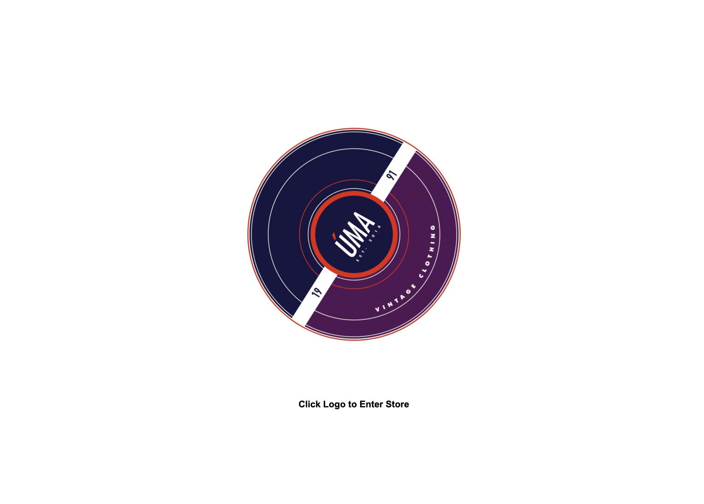

# UX 
The design of the website has been a collaboration with the author and the storeowners ideas for how the store should look. The minimalist design has it's limitations in terms of UX since it can come of as unclear. I'm aware that the lack of langueage could be a cause for concern since how to use the site can vauge to some people. But since it was pretty much a requirement from the client to keep language to a minimum I've tried to use as familiar symbols a possible to minimize confusion.

On the first page on is greeted with a spinning company logo. The Logo is based on a LP shape, the choice to rotate it for this reason probably is obvious. The first idea was to spin the LP in the same pace as it normally would, which is 33 roations a minute. Unfortunatly this made it possible to read what is written on the logo so a slower rotation speed was settled on.

The goal with the different parts of the site has been to keep them as similar as possible. 
The sites main color is white with black text, symbols and buttons. The choice to use white is in part a decision made with the intention to keep the content in focus. Another aspect is that the author is not famililar with many photos direction tools, the index page rotating photo has a white background.

The footer is despite it's languge very similar to the header in terms on design, the letters are bold and the Facebook logo is a familiar symbol to most people. 

# Features

## Header

Except for showing the name of the company which takes one to the front-page the header of the page has svereal functionalites. The drop down menu on the left is a filter, a user can filter through by price, category, clothing and go back to show all.
On the right there are three symbolsthe first symbolises a profile, it gives one ability to sign in or up. What is possible while logged in as a user or superuser will be covered later on. The second symbol is a cart, and takes one to the customers cart. The third displays a searchbar while clicked.

## Profile

Users of the site

## Footer

## Products

## Product details

## Cart

The cart displays the products that are in the cart, some general info about the products and the total, delivery cost and grand total.

## Profile

Users of the site can create their own profile, the main features availbable to a user is being able to save their delivery info and keep track of previous orders.

## Superuser

On top of the features availabel to a regular profile a supersusers profile has the abillity to add, edit and delete products from the site without having to use the admin page. 

## SKU

Since each product on the site is unique a product can not be added more than once and the maximum quantity is one. After the checkout the product is deleted.

## Message

## Checkout

### Stripe

## Facebook page

# Future features

* 

# Testing

## Manual Testing

## HTML

## CSS

## Python
[PEP8](http://pep8online.com//)

# Unfixed Bugs

# Deployment
Deployment on Heroku.
1. After login click New button in the right top corner.
2. Chose app-name and region.
3. Choose settings in the bar.
4. Click reveal Config Vars and add Key Port and the Value 8000.
5. Add the buildpack heroku/python and heroku/nodejs in this order.
6. Click on Deploy in the bar.
7. Click on connect on github in the Deployment method section.
8. Click search in the connect to GitHUb section and choose the relevant github repository.
9. Click on Automatic deploys or manual deploy depending on preference. Manual deploy was chosen for this      project.

 Here is a link to the finished project [Úma](https://uma-vintage.herokuapp.com/).

# Credits
TIM!!!

# Acknowledgements 

[Code Institute](https://codeinstitute.net) for providing excellent course material and tutoring.