## Index – Table of Contents    

* [HTML](##HTML)

* [CSS](##CSS)

* [JavaScript](##JavaScript)  

* [PEP8](##PEP8)

* [Manuel Testing](##Manual)

* [Responsive Design](##Responsive)

* [Device Testing](##Device)

## HTML

 [W3C Markup Validator](https://validator.w3.org/#validate_by_input) was used tfor the tests.
* base.html 
Since base.html is the page that all others extends from it has passed testing without issues.

* index.html
 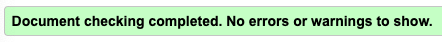

* products.html

* product_details.html

* edit_product.html / custom_clerable_file_input.html

The errors all seem to be caused while rendering the form in forms.py, forms.py does how ever work as intended so a bit unclear if these errors are a cause of concern or not. The forms were rendered as cripsy forms which potentially could cause the problems. custom_clerable_file_input.html did not have any errors.

* add_product.html 
The errors all seem to be caused while rendering the form in forms.py, forms.py does how ever work as intended so a bit unclear if these errors are a cause of concern or not. The forms were rendered as cripsy forms which potentially could cause the problems.

* cart.html

* checkout.html

* checkout_success.html

* profile.html
The error was cause by these lines of code and as obvious it's the validator that has missinterpreted the code. The same page-header code is present throught most of the files that extend from base.html and did not cause a error then.

* login.html
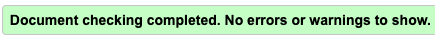

* signup.html

## CSS

[W3C Validator](https://jigsaw.w3.org/css-validator/#validate_by_input) was used to check the code.

All warning was cause by supplier extensions and are not considered a cause for concern. profile.css went through the W3C validator without issues.

## JavaScript

The javascript code was tested with [JSHint](https://jshint.com/).

* stripe_elements.json

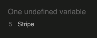

* cart.html json

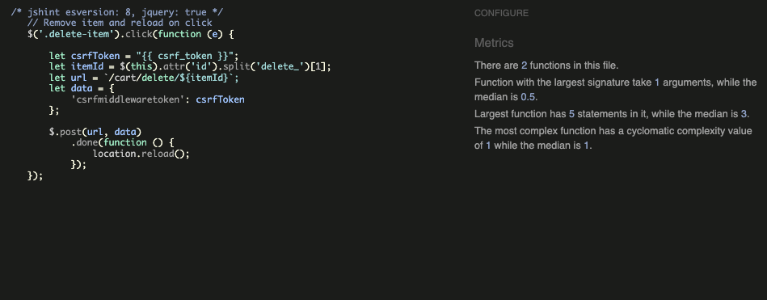

* countryfield.json

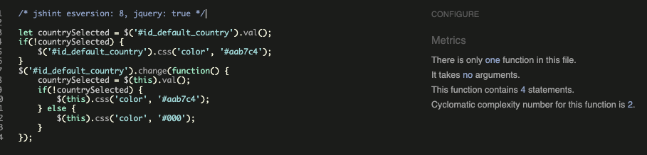

* categories.json

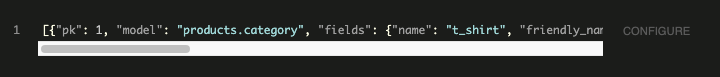

## PEP8

All python code went through a [PEP8 online test](http://pep8online.com/). 

* cart

apps.py

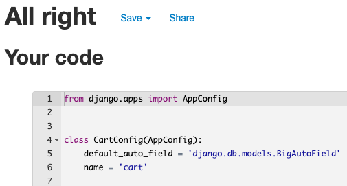

contexts.py

urls.py

views.py

* checkout

admin.py

apps.py

forms.py

models.py

signals.py

urls.py

views.py

webhook-handler.py

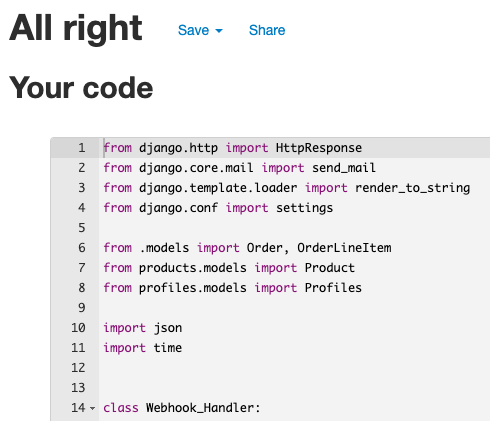

webhooks.py

* index

apps.py

urls.py

views.py

* products

admin.py

apps.py

forms.py

models.py

urls.py

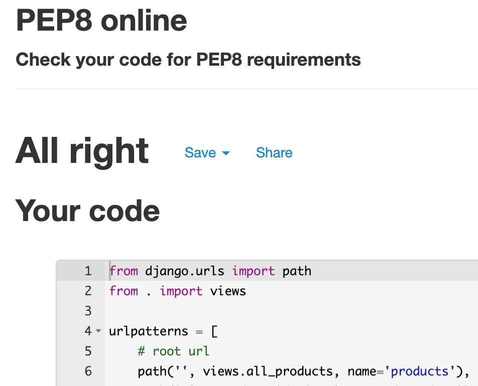

views.py 

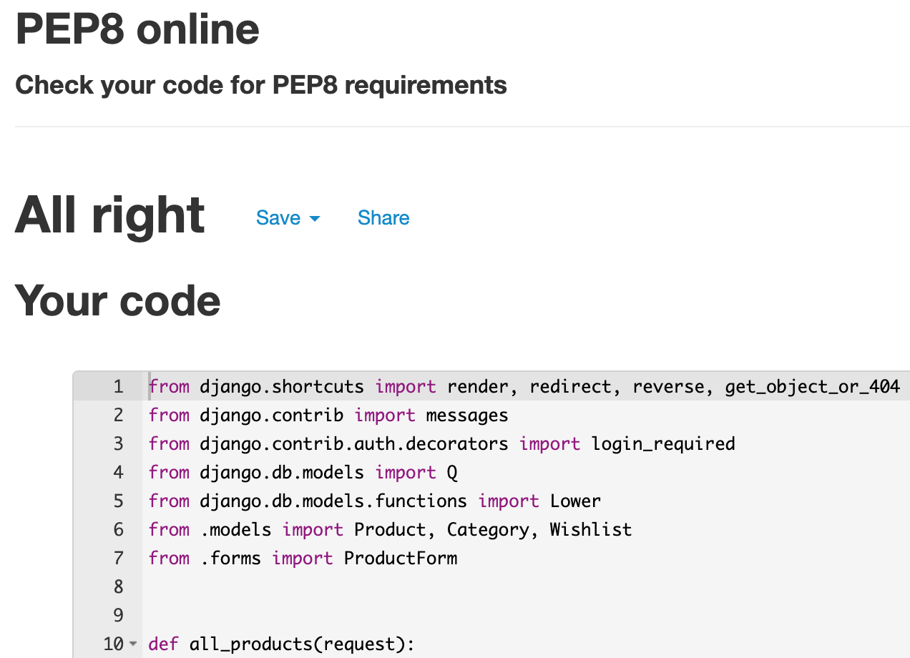

widgets.py

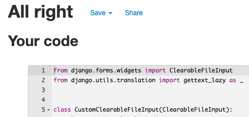

* profiles

admin.py

apps.py

forms.py

models.py

urls.py 

views.py

* uma 

setting.py

urls.py

wsgi.py

## Manual Testing

* Test users

User: testuser1
Pass: world123

Superuser: admin1
Pass: keeptesting

* Index, logo rotates, works.
* Index page logo doubles as a link and takes a user to the products page, works.

* Favicon on all pages, works.

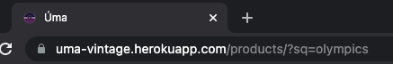

* Header filter, works.

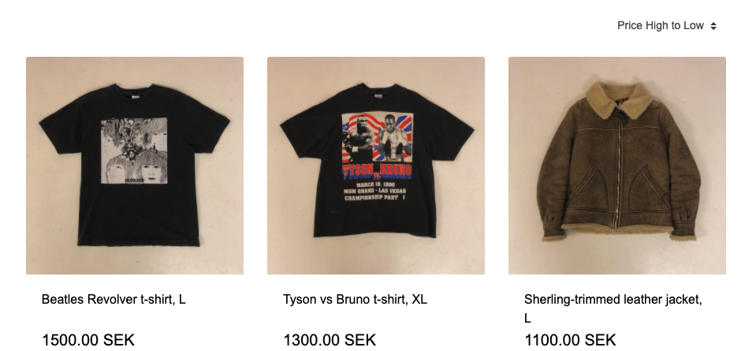

* Header searchbar works without issues.

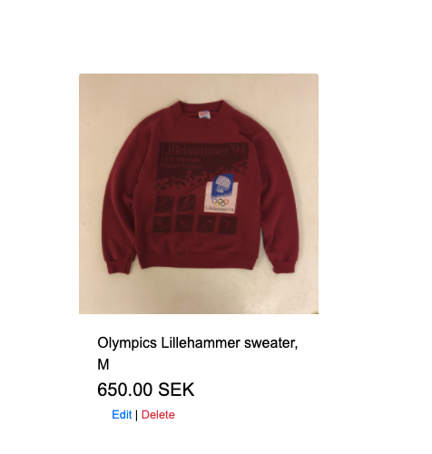

* Header cart takes the user to the cart, works.
* Header cart, product count shows under if products are added, works.

* Header profile dropdown, takes a user to allauth sign up if sign in pressed, works.

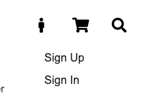

* Header profile dropdown, takes a user to allauth sign in if sign in pressed.

* Product, all products show, works.
* Product, on page filter, all works.

* Product, when a product is pressed a user comes to product details for the specific product, works.
* Product details, if `Back to Store` button pressed the user goes back to products page, works.
* Product details, if `Add to Cart` button pressed the product is added to the cart , works.

* Cart, only one of each product can be added to the cart since all products are unique, works.

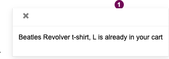

* Cart, all added products is shown in the cart, works.

* Cart, product information is shown, works.
* Cart, product can be deleted, works.

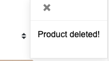

* Cart, total, delivery and grand total is calculated correctly, works.

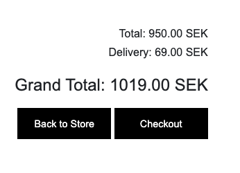
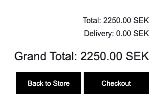

* Cart `Back to Store` takes the user to product page, works.
* Cart `Checkout` button takes the user to the checkout page, works.

* Checkout, form with relevant delivery inputs, works.
* Checkout, faulty inputs in form are not accepted and what the customer needs to do is obvious after pressing `Complete Order`, works.
* Checkout, order summary, works.
* Checkout, `Create an account` and `login` under form works and takes a user to respective alluth htmls, works.
* Checkout, `Adjust Cart` button works and takes a user to the cart.
* Checkout, if correct input in form, payment info and `Complete Order` button pressed the order goes through and the user is taken to the checkout succes page, works.
* Checkout, bought products are removed from site, works.

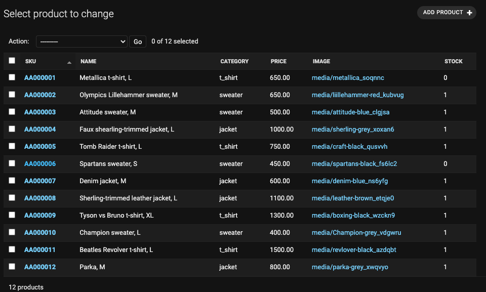

* Checkout success, order info shown, works.

* Checkout success, if `Back to Store` button pressed the user is taken back to products page, works.
* Checkout success, the customer receives a order confirmation email, works.

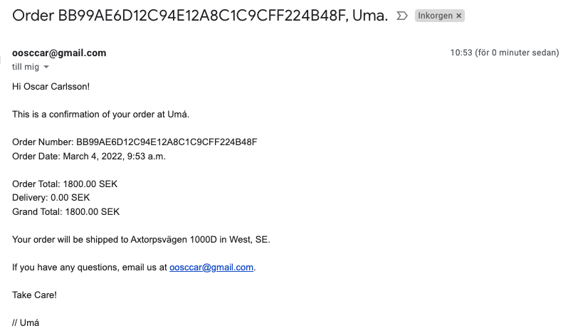

* Messages, add product displays toast_intend with correct products, works.

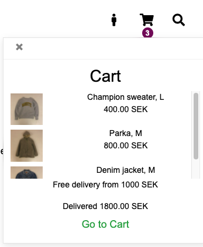

* Messages, info, delete and warning, works.

* User Profile, can be created, works.

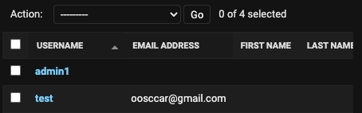

* User Profile, receive confirmation mail (tested via authors mail) and link that finalizes the profile, works.

* Profile info, can be saved and is shown during checkout, works.

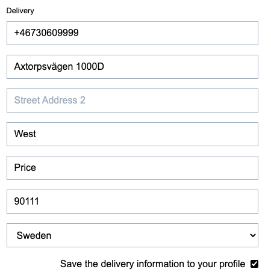

* Profile info, past orders is shown on page, works.

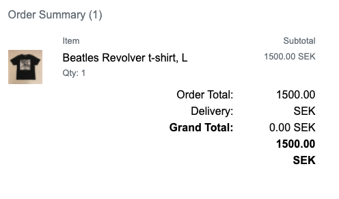

* Superuser, add product, works.

* Superuser, edit product, works.

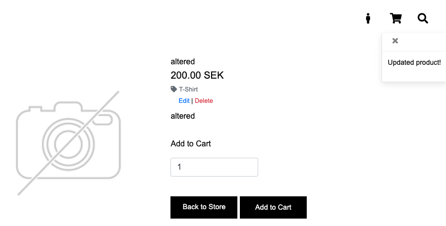

* Superuser, delete product from product page, works.
* Superuser, delete product from product details page, works.

Test card numbers.

* Stripe Webhooks, checkout succeedes with booth card numbers on page, works.

* Stripe Webhooks, payment goes through on Stripe, works.

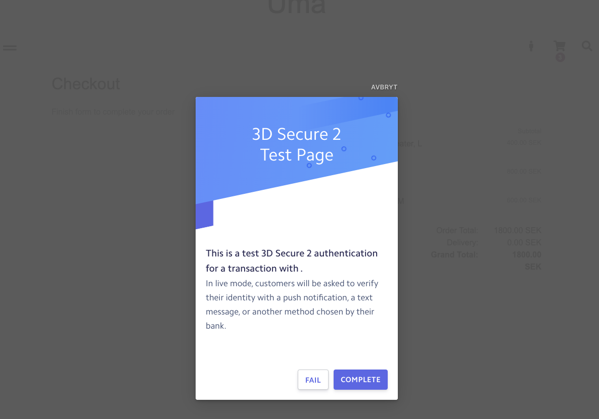

## Responsive design

### Pages availabel to all

* Large screen

Front page

Header

Footer

Products page

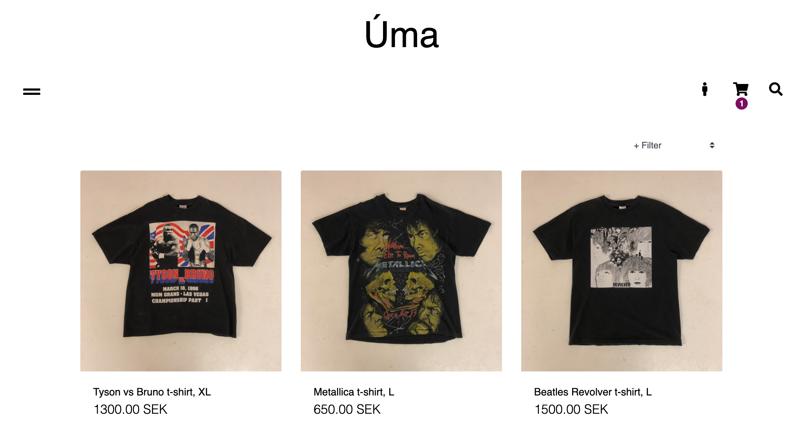

Product details

Cart

Checkout

Checkout success

Sign in

Sign out

* Laptop

Front page

Header

Footer

Products

Product details

Cart

Checkout

Checkout success

Sign in

Sign out

* Phone

Front-page

Header

Footer

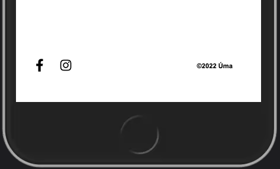

Products

Product details

Cart

Checkout

Checkout success

Sign in

Sign out

### Pages availabel to users with profiles

* Large Screen

Profile

* Laptop

Profile

* Phone

Profile

### Pages availabel to superusers

Products
Will only show one page since identical to products page except for edit | delete.

* Large Screen

Add products

Edit products

* Laptop

Add products

Edit products

* Phone

Add products

Edit Products

## Device Testing

Phone:

* Iphone 7 - Works.

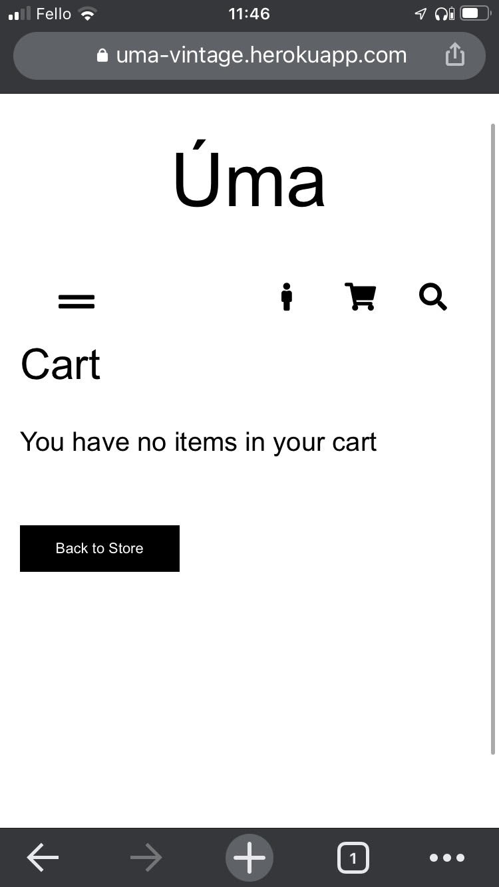

* Samsung A51 - Works.

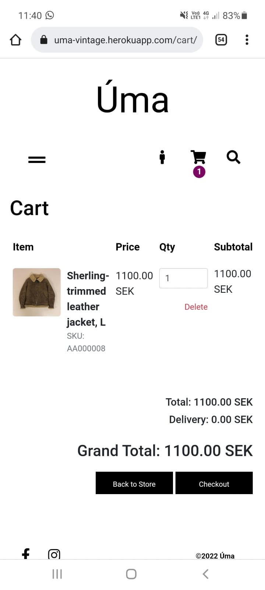

Laptop:

* Mac Book Pro, Chrome - Works.

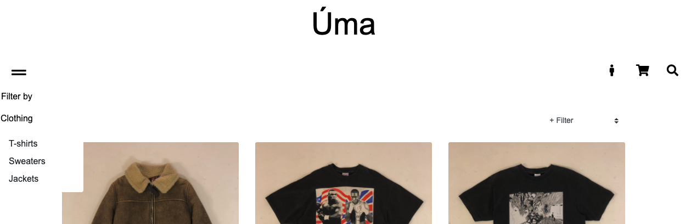

* Mac Book Pro, Firefox - Works.

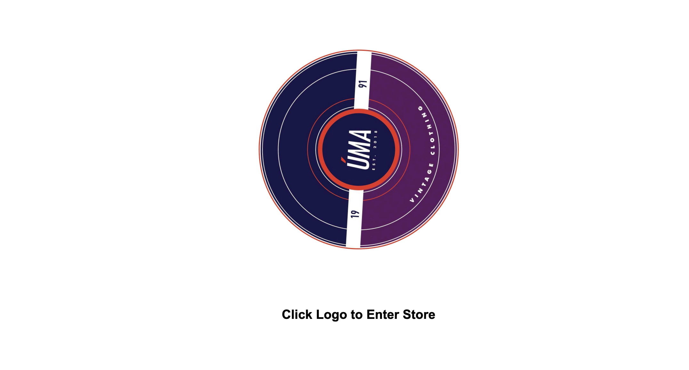

* Mac Book Pro, Brave - Works.

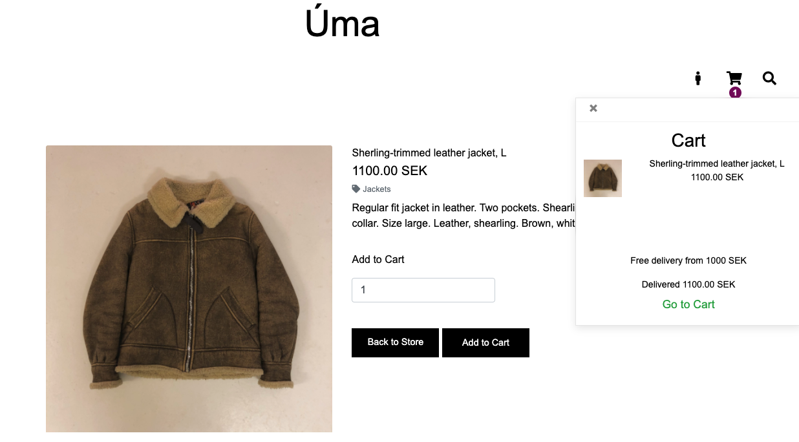

Tablet: 

* Ipad A2270, Chrome - Works.

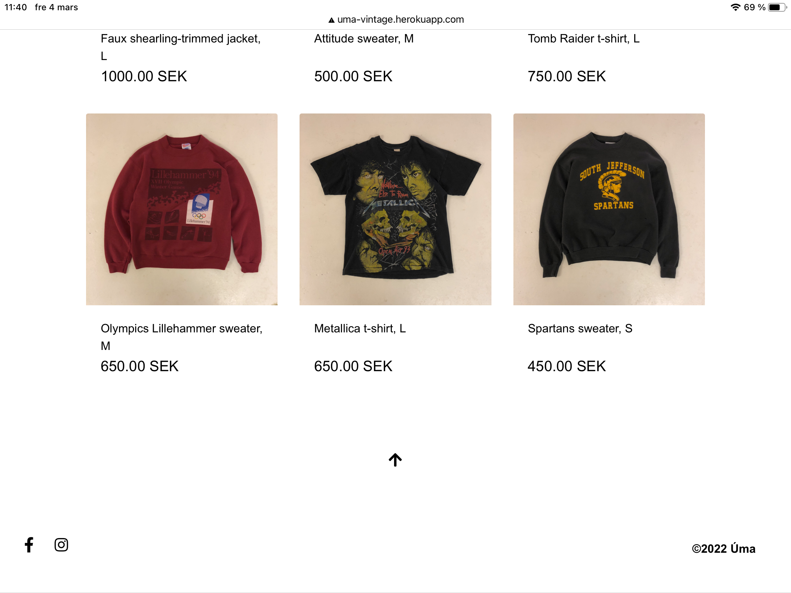